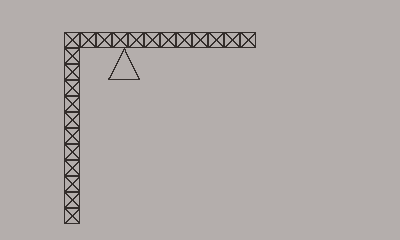

# PlayDate Collision Detection Bug

## Description

When a sprite is rotating, the collision detection goes crazy.

## How to Reproduce

* The player is directed using the crank.
* Pressing `A` toggled the player sprite rotation on and off.
* Pressing `B` resets the player sprite's rotation to `0`.
* Pressing `Up` or `Down` will cycle through the collision types.
  1. `kCollisionTypeSlide`
  2. `kCollisionTypeFreeze`
  3. `kCollisionTypeOverlap`
  4. `kCollisionTypeBounce`

Bump the sprite into the walls.  With any collision type other than `kCollisionTypeOverlap` the sprite will perform as expected when rotation is disabled, but will tunnel occasionally tunnel through it when it is set to any of the other types.

* Pressing `Left` or `Right` will swap the walls from tiled, individual sprites to single, long sprites.

*NOTE*  We can reproduce the behaviour in both scenarios.